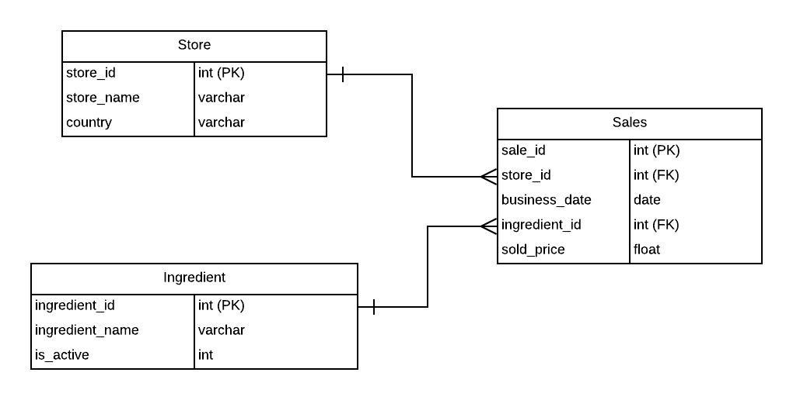

# Earls Technical Assignment

Please download this repository and import all the contents into a new repository. Ensure that it has "Public" visibility to be shared with us.

Feel free to use any online resources available to help solve this assignment. Once you have completed the assignment, submit it by sharing your repository link with us.

There are two parts to this assignment:
1. Build a Django application to display data from a BigQuery public dataset. You will need to compile two queries and create separate views to display the requested dataset.
2. Based on an ERD, compile queries to solve three questions.

## Part 1: Django BigQuery Application

1. Set up the Django web framework with the `google-cloud-bigquery` client library from pip. Use the skeleton code in `bigquery_sample/` as your foundation.
2. Verify that the application can run on localhost.
3. Using the function `hacker_news` found in `views.py`, create a view accessible by users via this url [localhost:8080/latest_hacker_news](localhost:8080/latest_hacker_news). The view should return the following results:
    - Displays the title, author's name, and date of publication of the latest 5 articles from the `stories` table . The dataset can be obtained from the public dataset `hacker_news` (`bigquery-public-data.hacker_news.stories`).
4. Using the function `github` found in `views.py`, create a view accessible by users via this url [localhost:8080/most_commits](localhost:8080/most_commits). The view should return the following results:
    - Displays the individuals with the most commits from the `sample_commits` table in 2016. Display the name and number of commits sorted from most to least commits. The dataset can be obtained from the public dataset `github_repos` (`bigquery-public-data.github_repos.sample_commits`).
5. If applicable, compile a README for the project.

___

## Part 2: SQL Questions

Use the following ERD to answer the next set of questions. Please record your answers in the `SQL_answers.sql` file.

1. Based on the ERD provided, write a SQL query to find the number of occurrences that an ingredient named “Lobster Ravioli” was sold at each store. Rank the stores by dishes sold with the highest occurrence first.

2. Revise the query from Question #1 to limit the dataset queried between April 1st, 2021 to May 1st, 2021. Return only the stores that have sold more than 45 Lobster Ravioli dishes.

3. Referencing the Sales table, write the corresponding `CREATE` SQL DDL statement. Include and provide justification for any improvements or add-ons as you see fit.
